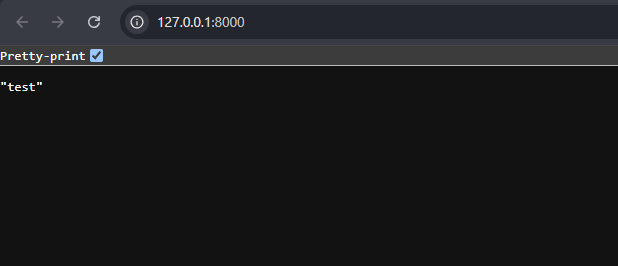

# fireguard-group-6
To run the project you will have to run:
>- poetry install -> to initialize the packages
>- py main.py -> you have to create your own .env file and add the credentials <a href="https://pypi.org/project/dynamic-frcm/">as described</a>

The .env file should be added in the src folder:

After checking that the project runs as intenden, head to the [backend folder](/backend/) and run:
> - fastapi dev main.py   

to check that <a href="https://fastapi.tiangolo.com/">fastAPI</a>, which is the API-framework we'll be using, works. It should look something like:

## Commands ran:
<li>poetry init</li>
<li>poetry add dynamic-frcm</li>
<li>poetry add python-dotenv</li>
<li>pip install "fastapi[standard]"</li>

# Git Commands Cheat Sheet
These are just added from the top of my head, so syntax and explanation may be a bit off, but feel free to google them. As some of the are necessary and others are convenient.

### `git clone <repository_url>`
Creates a local copy of a remote repository. This is typically the first step when you want to start working on an existing project.

### `git pull`
Fetches the latest changes from the remote repository and merges them into your current branch. This keeps your local copy up to date with the project.

### `git push` (or `git push --set-upstream origin <branch_name>`)
Pushes the committed changes to the remote repository. If the branch doesn't exist on the remote yet, use the `--set-upstream` option to set the remote tracking branch.

### `git add .`
Stages all the modified files in the current directory and its subdirectories for commit. Use with caution, as this will include all changes, even those you might not want to commit.

### `git add <file_name>`
Stages a specific file for commit. Only the specified file will be included in the next commit, allowing you to be more selective about what you commit.

### `git commit -m "<message>"`
Commits the staged files to the local repository with a descriptive message. The message should explain the purpose of the commit.

### `git status`
Displays the status of your working directory and staging area. It shows which files have been modified, which are staged for commit, and which are untracked, helping you understand the current state of your repository.

### `git merge <branch_name>`
Merges the specified branch into the branch you're currently on. This is how you integrate changes from one branch into another.

### `git stash`
Temporarily saves your changes on a local stack, allowing you to revert your working directory to the last commit. You can later retrieve these stashed changes using `git stash pop` to apply them back.

### `git checkout -b <branch_name>`
Creates a new branch and switches to it immediately. This is useful for starting new features or tasks without affecting the main branch.

### `git checkout <branch_name>`
Switches to the specified branch, updating your working directory to reflect the state of that branch. This allows you to work on different parts of the project in isolation.

### `git restore .` or `git restore <file_name>`
Restores the local (unstaged, I think) changes to the origin. Useful if you want to discard the local changes.
